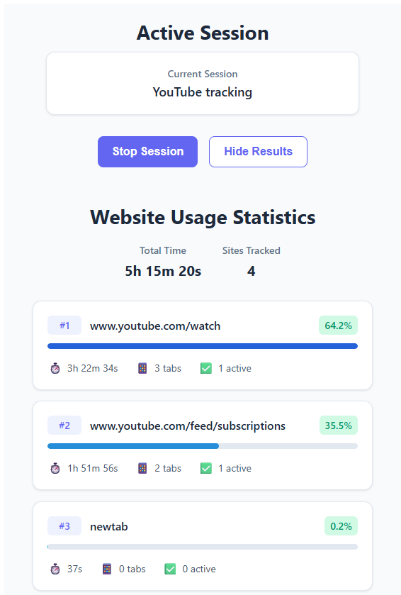
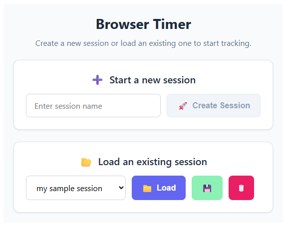

# Browser Timer
### The best way to track the time spent browsing

----
#### Why should I use it?

If you ever find yourself wondering how much time you spend and where you spend it on the internet, this browser extension
is the right tool for you. It allows for tracking the time spent on any website, working silently in the background.

Create sessions suited to your needs. Stop and resume them at will. Maybe you wanted to track the time spent on entertainment? How long did you watch a particular TV series on Netflix or spent watching YouTube videos? Create a separate session for that. Or maybe you wanted to compare your daily browsing experiences? Create a new session each day or 
back up the existing one daily to see how your usage grows day by day.

The extension supports multiple active browser windows.

#### How to install it?

Extension supports only Chromium-based browsers (Google Chrome, Opera, Brave, etc.) 

1. Download the `BrowserTimer.zip` folder and unpack it.
2. In your browser of choice, go to the extension tab, enable the "developer" mode and choose to load unpacked the entire `web` folder
3. Inside the `native` folder, update the `browser_timer.json` file:
    - change the `path` to the absolute path to the `native.exe` (If you are not running a Windows OS, you need to build the `native.exe` yourself from the source code. If you are on Windows, you can use the provided one)
    - change the allowed origin in extensions. Replace "YOUR EXTENSION ID HERE" with the actual extension Id - you can see it in your browser after step 2.
4. Register the `browser_timer.json`:
   - on Windows: add the registry key under `HKEY_CURRENT_USER\Software\Google\Chrome\NativeMessagingHosts\browser_timer` with the value of the absolute path to the `browser_timer.json` file
   - on MacOs/Linux: move the .json to the correct folder under the `.../Google/Chrome/NativeMessagingHosts` path

Application logs are stored in the `/native/logs` folder. Sessions and session backups are saved in the local user data directory (`\AppData\Roaming\browser_timer` on Windows).

If you get the "Couldn't connect to the native host" error on extension start-up and have configured it correctly, try reloading the extension in the browser extension management tab.

For whatever reason, Windows Defender thinks that the `native.exe` is malicious. If you wish to build the whole extension by yourself from the source code instead of downloading the prodived `.zip` folder, then feel free to do so. The web part is bundled with Vite.

#### How to use it?

After installation, load the desired session or create a new one. To see the most recent data, toggle the "Show results" button. The session will save itself when you close the browser, so don't worry 
if you had closed it without having stopped the session manually beforehand. One click is all it takes to start or stop the tracking!
